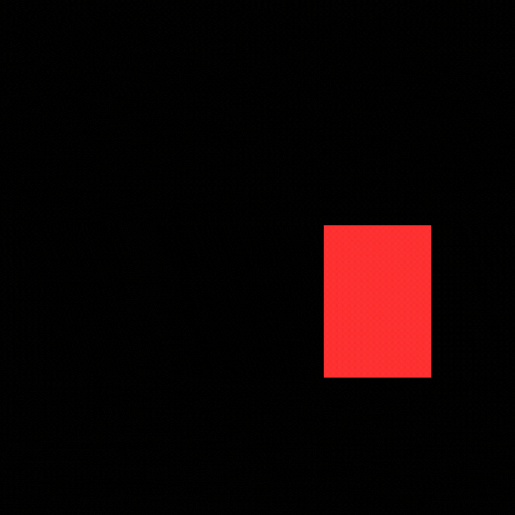
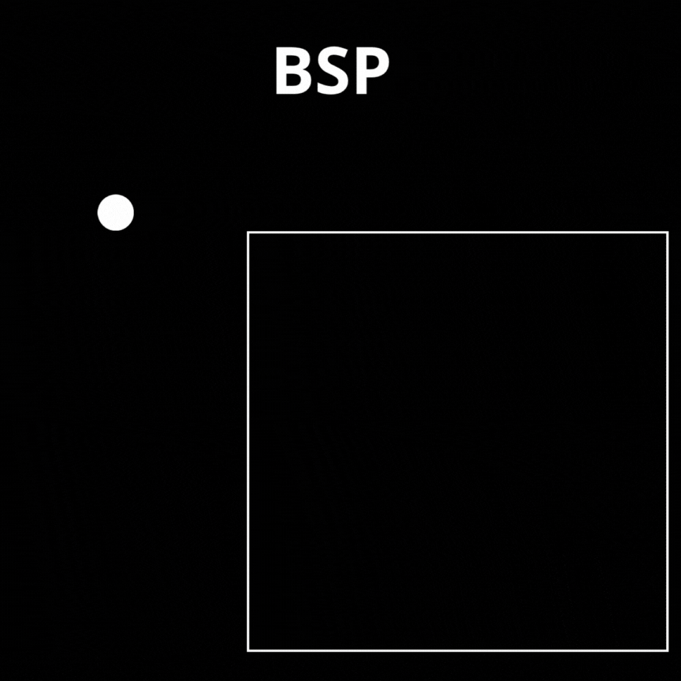
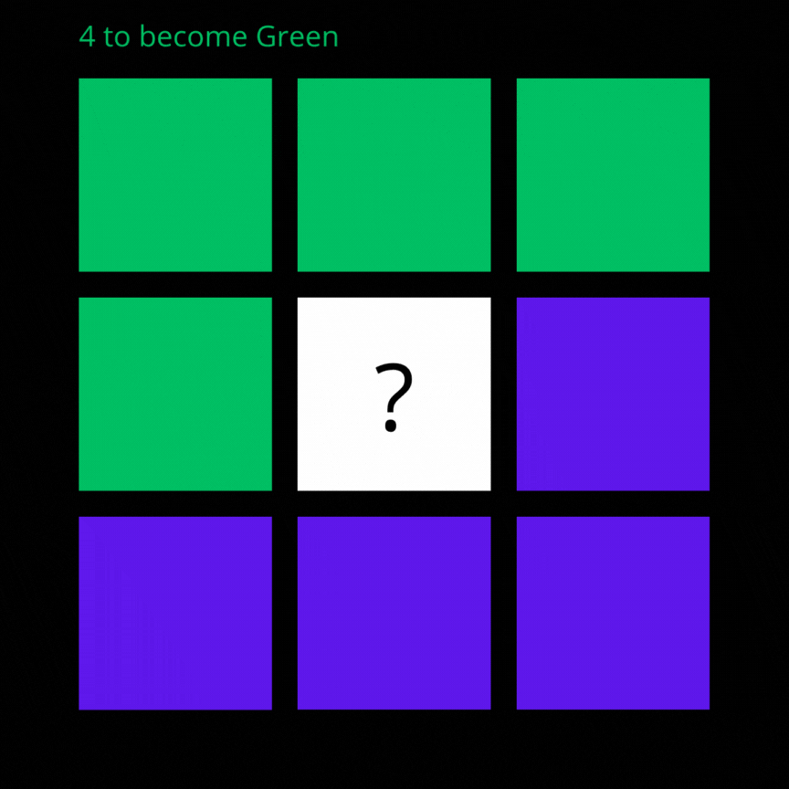

# GENERATION PROCEDURAL

---

## ✨ DIFFERENTS SYSTEMS DE GENERATION PROCEDURAL


- Simple Room Placement 
- BSP
- Cellular Automata
- Noise

---

## 🎮 GENERATION PROCEDURAL

| Scène                | GIF                        |
|----------------------|----------------------------|
| SIMPLE ROOM PLACEMENT : Choisi une Zone aléatoire et place une nouvelle room en vérifiant que ça ne chevauche pas une autre  |   |
| BSP : On trace un carré qu'on divise par deux en deux node. On réitère plusieurs fois. Puis chacun on crée une room dans chaque node enfant. Ensuite on relie tous les nodes par paire. |  |
| CELLULAR AUTOMATA : Chaque tuile, vérifie ses voisins. Et si il y'en a plus de X, elle se transforme en les autres. |  |

## 🎮 GENERATION PROCEDURAL AVEC NOISE

|                 | Lien                        |
|----------------------|----------------------------|
|Noise : |https://auburn.github.io/FastNoiseLite/|
|Script : |https://github.com/Auburn/FastNoiseLite|

Les zones blanches dans le noise sont = à 1 et le noir à -1.
Il y'a différents types de noise qui permets de manier différemment le dégradé ou la forme des zones.
On peut ensuite l'utiliser pour placer du relief, des couleurs...
---

## 🛠️ Installation

```bash
# Cloner le repo
git clone https://github.com/tonpseudo/ton-projet.git

# Ouvrir dans Unity (ou autre moteur)
# puis lancer la scène principale